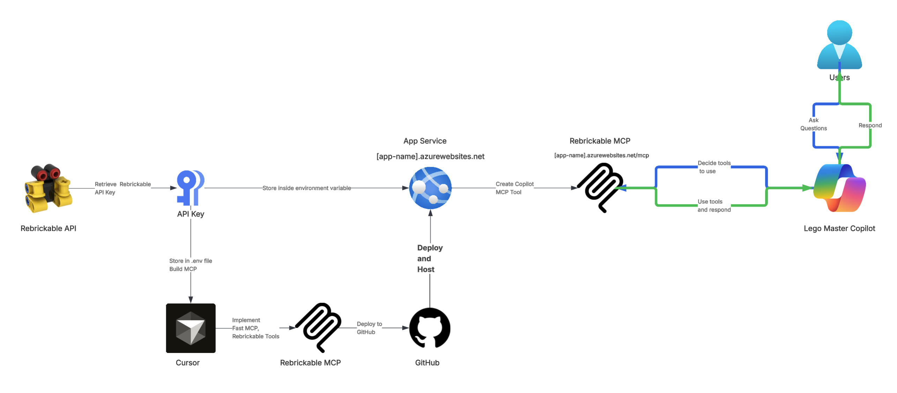
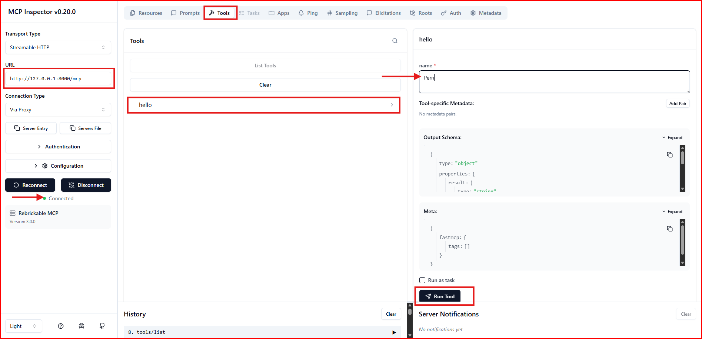
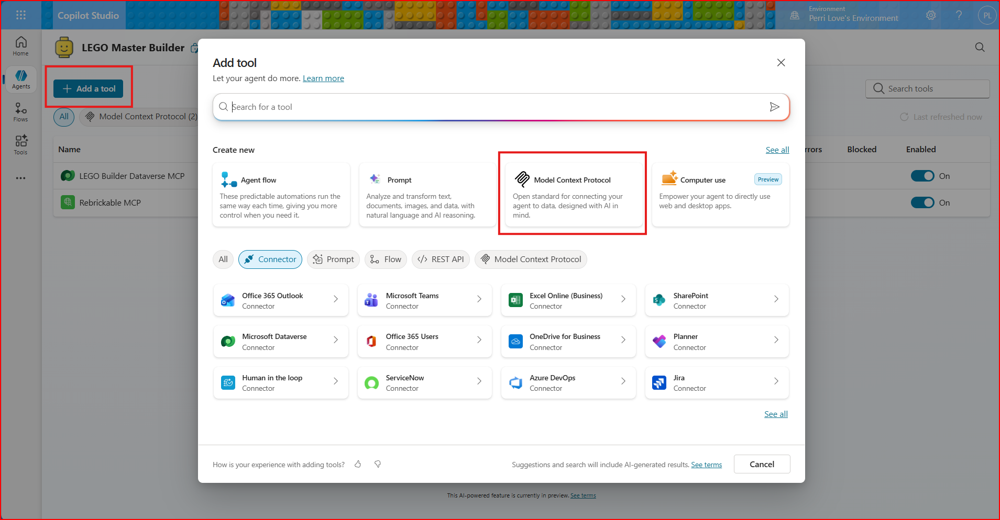
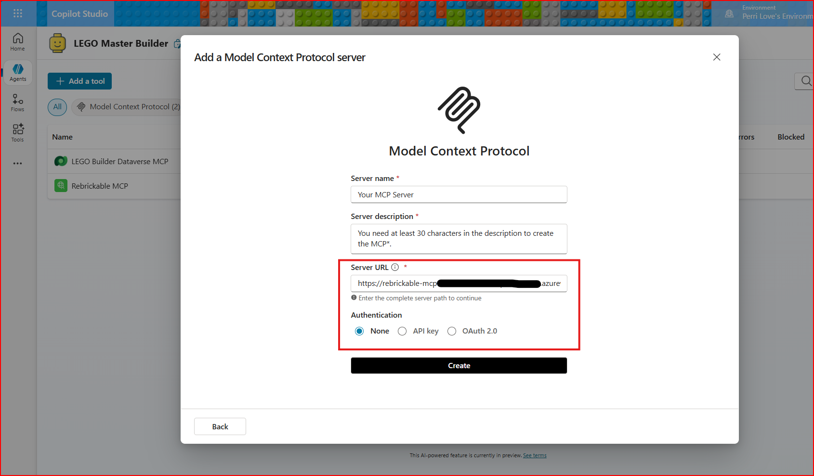
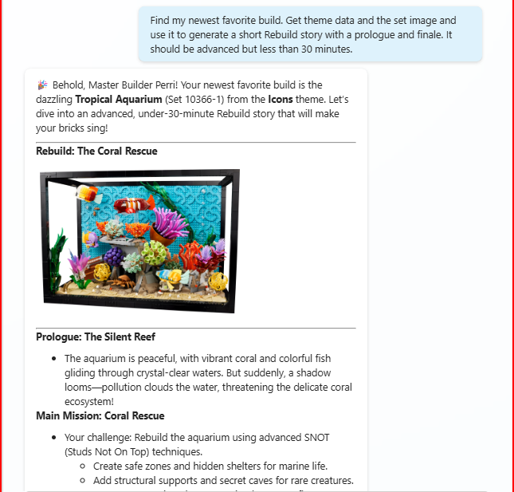

## Example app and Demonstration: Rebrickable MCP Server in Copilot Studio

### Architecture

<p align="center">
   
</p>

---

### Rebrickable

- A free, open database that contains a catalog of LEGO sets, parts, colors and various relationships.
- Has separate CSV files and an API

### Example Application

- Copilot Studio plays the part of the **host application** or **Agentic AI Application**
- The Rebrickable MCP server implements tools that use the Rebrickable database.
- The Copilot Studio test pane will be used to submit prompts
- The Copilot Studio Agent will determine which MCP tools to call and how to solve the problem

### MCP Server Code

Each tool can either be annotated with **@mcp.tool()** or **@mcp.resource()** or registered using **mcp.add_tool** or **mcp.add_resource**
and defined with inputs and outputs. Each method is then implemented with regular python code.

The snippet below is an abbreviated version.
The full version can be found at <a href="https://github.com/3CloudSolutions/rebrickable-mcp">Github: Rebrickable MCP</a>


```python
import logging
from blob.storage import load_csv

logger = logging.getLogger(__name__)
rows = load_csv("sets.csv")

def normalize_set_num(set_num: str) -> str: 
    #If the user gives 21318, convert to 21318-1
    if "-" not in set_num:
        return f"{set_num}-1"
    return set_num

def get_set_details(set_num: str) -> dict:
    set_num = normalize_set_num(set_num)
    logger.info(f"get_set_details called with set_num: {set_num}")

    logger.info(f"Loaded sets: {len(rows)} from sets.csv")

    for row in rows:
        if row["set_num"] == set_num:
            logger.info(f"Match found for set_num: {set_num}")
            return row
    logger.warning("No match found.") 
    return {}

def search_sets_by_name(query: str, limit: int=50) -> list[dict]:
    logger.info(f"search_sets_by_name called with query: {query}")
    query = query.lower()
    matches = [row for row in rows if query in row["name"].lower()]
    return matches[:limit]

def list_sets_by_year(year: int, limit: int=50) -> list[dict]:
    logger.info(f"list_sets_by_year called with year: {year}")
    
    matches = [row for row in rows if int(row["year"]) == year]
    return matches[:limit]
```

### MCP Application Code

Each tool is registered to the MCP server, which allows the MCP server to initialize the tools for use. 

```python
from mcp_instance import mcp
from tools.sets import get_set_details, search_sets_by_name, list_sets_by_year, list_sets_by_piece_count, get_set_image

#Register SET tools
mcp.add_tool(get_set_details)
mcp.add_tool(search_sets_by_name)
mcp.add_tool(list_sets_by_piece_count)
mcp.add_tool(list_sets_by_year)
mcp.add_tool(get_set_image)

print("Server file imported")

app = mcp.http_app()

if __name__ == "__main__":
    import uvicorn
    # -- local STDIO v0
    # mcp.run()
    #mcp.run(transport="http", host="127.0.0.1", port=8000) v1
    # -- https ASGI Streamable v2
    uvicorn.run("server:app", host="127.0.0.1", port=8000, reload=False)
```

### Executing the MCP server locally
In Powershell or Terminal in the python directory, run the MCP Server locally. The loopback is 127.0.0.1:8000/mcp

```
python server.py
```

or explicitely via uvicorn's ASGI (streamable HTTP) entrypoint
```
uvicorn server:app --host 127.0.0.1 --port 8000
```

The uvicorn command ues the app object in server.py [server:app] to run the MCP server so that tools and resources can be accessed over HTTP. Using the uvicorn command is a good test of the application running correctly in the Azure Web App.

### Testing locally

MCP Inspector is an interactive developer tool for testing and debugging MCP servers. It runs directly through npx without requiring installation.

After your MCP server is running locally, open a new termina/Powershell window within the directory and enter the MCP Inspector startup command

```
npx @modelcontextprotocol/inspector@latest
```

<p align="center">
   
</p>

### Push to Production/Live Agent testing

- The MCP server code was housed in a GitHub repository and leveraged GitHub Actions to push new changes to an Azure Web App Service. The Azure Web App URL is used to connect to the MCP server from the Copilot Agent.
- Detailed instructions can be found <a href="https://www.linkedin.com/pulse/from-scratch-copilot-deploying-custom-fastmcp-server-azure-perri-love-jfizc/">here</a>


### Connecting to Copilot

- Add a new tool to your agent. Select Model Context Protocol from the list of suggested tools.
<p align="center">
   
</p>

- Configure your MCP server tool by connecting to the Azure Web App URL
<p align="center">
   
</p>

### Example Demo Results

<p align="center">
   
</p>
