# Part 3, Session 17 - Cursor Deep Dive

## Topics we'll cover in this Deep Dive Session

- Review Vibe Coding and Vibe Learning
- Review Agency and Agentic
- Manually adding the Azure MCP Server to Cursor
- One-click installations of MCP servers from the Cursor Marketplace - Firecrawl and Hugging Face
- The Cursor Command-Line Interface (CLI)
- Skills
- A brief example of using Claude Code with portable Cursor skills

The intended purposes of this session is to:
- Increase your knowledge of **MCP** and **Agentic AI**
- **Increase your productivity with Cursor to accelerate your learning**

Remember my prediction from the first session?

> Prediction: You will learn more from AI (i.e. - Cursor) than from Chris.
> I'm just your "travel guide".

<br><br>
---
<br><br>

## Previously Covered in this Series: simple Vibe Coding and Vibe Learning

Simple **Vibe Coding** - create some code.

<p align="center">
   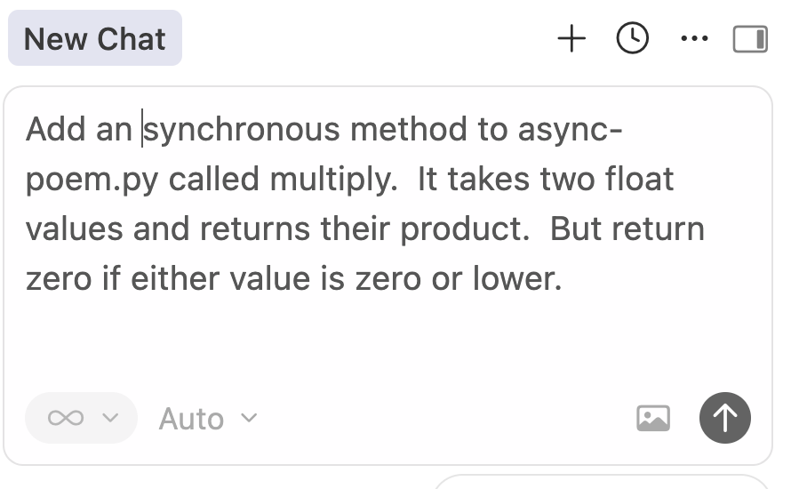
</p>

Simple **Vibe Learning** - explain some code.

<p align="center">
   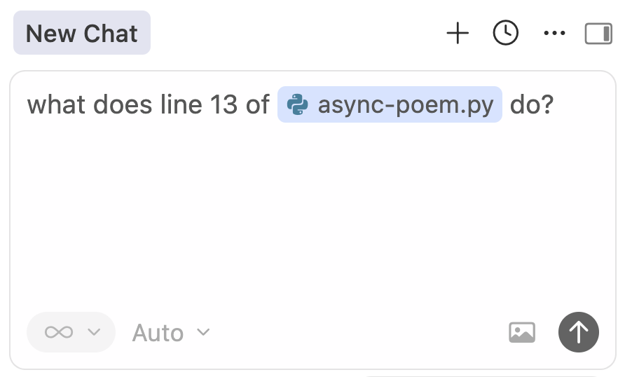
</p>

<br><br>
---
<br><br>

## Agency and Agentic 

A review of this important topic from the previous session on MCP.

### Agency (for humans)

> [Agency](https://en.wikipedia.org/wiki/Agency_(psychology)) is the sense of control
> that you feel in your life, your capacity to influence your own thoughts and behavior,
> and have faith in your ability to handle a wide range of tasks and situations

The key word here is **control**.

### Agency (for agentic AI applications)

- You define the set of MCP Server(s) that the application can use 
  - The collective set of tools and resources (see above)
- Given a task to complete (i.e. - a prompt), the agentic application will operate **autonomously**
- It will determine what MCP Servers, tools, and resources to use, and in what sequence
- This is a NOT Developer-specified set of imperative logic 
- **Instead, the Agentic AI application figures out, itself, how to complete the task!**

The key concept here is **autonomous control**.

<br><br>
---
<br><br>

## Using MCP Servers with Cursor

Cursor can act as an **Agentic Model Context Protocol (MCP) client**
using a set of custom and/or marketplace MCP servers.
The MCP servers can be local to your computer or remote.

> Installing Model Context Protocol (MCP) servers in Cursor can be done 
> through a one-click installation or manual configuration using the mcp.json
> file. This process connects external tools and data sources to your AI 
> agent within the Cursor

See the previous [session-mcp-the-model-context-protocol](session-mcp-the-model-context-protocol.md)
session where we described the Model Context Protocol and created/deployed a **local MCP server**
to Cursor.  It uses my **m26** python library for running calculations.

In this session we'll see more advanced uses of Cursor and MCP.

<br><br>

### Adding the Azure MCP Server (manually)

See https://learn.microsoft.com/en-us/azure/developer/azure-mcp-server/get-started/tools/cursor

Add the following configuration to the mcpServers **mcp.json** file:

```
"Azure MCP Server": {
  "command": "npx",
  "args": [
    "-y",
    "@azure/mcp@latest",
    "server",
    "start"
  ]
}
```

#### Wait, where is the Cursor mcp.json file located?

- **macOS/Linux**: ~/.cursor/mcp.json (the ~ stands for your home directory)
- **Windows**: %USERPROFILE%\.cursor\mcp.json  (also in your home directory)

After adding the Azure MCP Server the **mcp.json** file looks like
the following.  The m26-mcp-server was presented in the MCP
session on 3/31.

```
{
  "mcpServers": {
    "m26-mcp-server": {
      "command": "uv",
      "args": [
        "run",
        "--project",
        "/Users/cjoakim/github/zero-to-AI-private/python/m26-mcp-server.py",
        "--with",
        "fastmcp",
        "fastmcp",
        "run",
        "/Users/cjoakim/github/zero-to-AI-private/python/m26-mcp-server.py"
      ],
      "env": {},
      "transport": "stdio"
    }
  },
  "Azure MCP Server": {
    "command": "npx",
    "args": [
      "-y",
      "@azure/mcp@latest",
      "server",
      "start"
    ]
  }
}
```

#### Wait, what's npx? (and npm, and node.js?)

> Npx (Node Package eXecute) is a powerful CLI tool bundled with npm (v5.2.0+)
> that allows you to run Node.js binaries and packages without permanently 
> installing them globally.
> To install npx on Windows, you must install Node.js, as npx is automatically included

Install Node.js on Windows with the following command:

```
winget install OpenJS.NodeJS.LTS
```

**Node.js** is a high-performance version of **JavaScript** that runs outside of a web browser.
JavaScript originally ran only within web browsers.

Rabbit hole: [TypeScript](https://www.typescriptlang.org) is an excellent way to author 
JavaScript code, as it looks like C# and has a compiler.  The compiled/transpiled code 
is solid and reliable.

<br><br> 

### Using the Azure MCP Server

Now we can ask the following in the Cursor Chat tab - "List my Azure storage accounts".

<p align="center">
   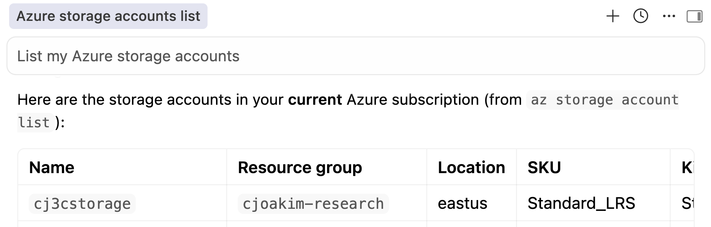
</p>

This MCP server connects to Azure using your **az login** credentials.
Read more about the [az](https://learn.microsoft.com/en-us/cli/azure/install-azure-cli)
program here.

<br><br>

### Adding the Firecrawl MCP Server (from the Marketplace, with one-click)

Let's visit the [Cursor Marketplace](https://cursor.com/marketplace).

Marketplace home page looks like this.

<p align="center">
   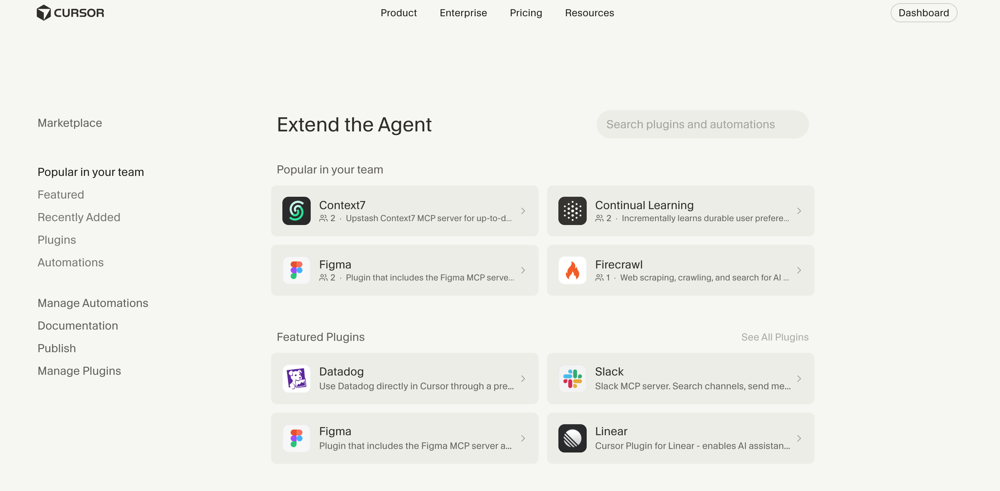
</p>

Click into Firecrawl.  It's a web scraping, crawling, and search for AI agents.
Gives Cursor full access to web content through the Firecrawl CLI.

<p align="center">
   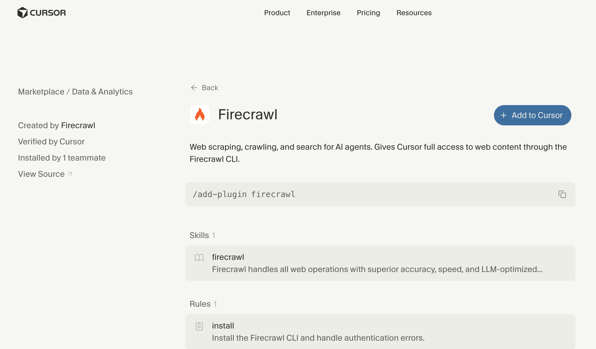
</p>

Simply click the blue **Add to Cursor** button.  

In Cursor, navigate to the plugins configuration
**Cursor --> Settings --> Cursor Settings --> Plugins**
and see that Firecrawl is now installed.

<p align="center">
   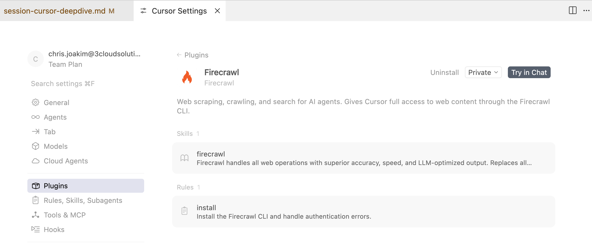
</p>

<br><br>

See the saved [firecrawl usage instructions as markdown](firecrawl.md).

**Oh, surprise! Firecrawl requires a subscription!**
Regardless, this shows you how to install a MCP server or plugin from the Marketplace with one-click.

<br><br>
---
<br><br>

### Adding the Hugging Face MCP Server (from the Marketplace, with one-click)

In Cursor, navigate to the plugins configuration UI 
**Cursor --> Settings --> Cursor Settings --> Plugins**.

Then enter **Hugging Face** in the search field.  Hit enter.

Click the blue **Add to Cursor** button.

<p align="center">
   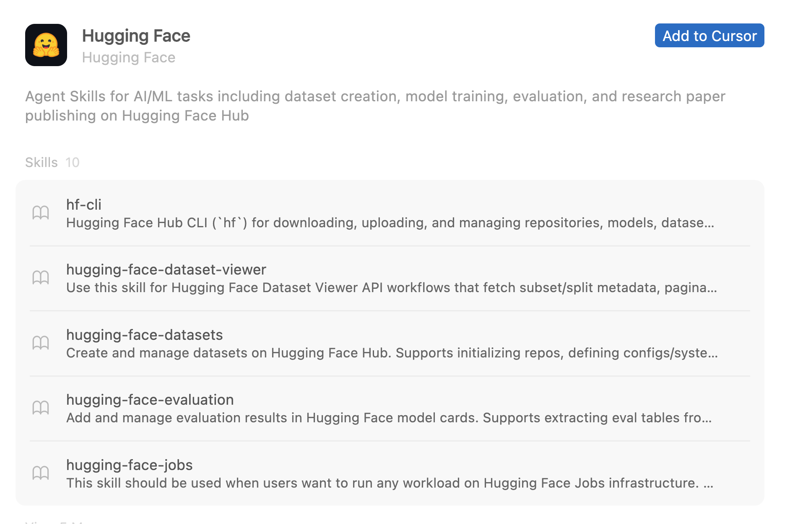
</p>

Ask Cursor how to use Hugging Face, and save the output as markdown.

<p align="center">
   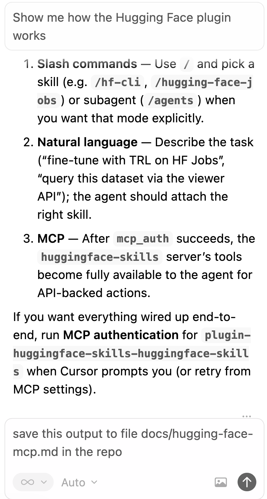
</p>

See the saved [hugging usage instructions as markdown](hugging-face-mcp.md).

Note: This section assumes that you have an account at
[Hugging Face](https://huggingface.co/), and have the **hf** CLI program installed (I do).

### Using the Hugging Face MCP Server

Now we can ask the following in the Cursor Chat tab - 
"list the top five trending hugging face datasets.".

<p align="center">
   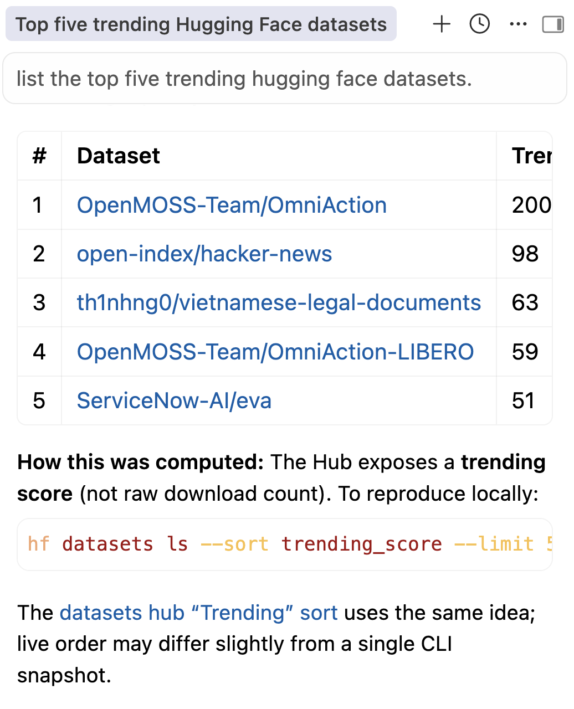
</p>

### Pro Tip

Don't keep any unusable Plugins or MCP servers configured in Cursor.
Otherwise, Cursor may try to use them.

For example, Cursor tried to use Firecrawl MCP server, even though 
I don't have a Firecrawl account.  Therefore, I removed this plugin.

<br><br>
---
<br><br>

## Using the Cursor Command-Line Interface (CLI) 

This is an alternative to the Cursor UI.  You can use one, or both.

See https://cursor.com/docs/cli

### Agent Mode Help Info

```
[~/github/zero-to-AI]$ agent --help

Usage: agent [options] [command] [prompt...]

Start the Cursor Agent

Arguments:
  prompt                       Initial prompt for the agent

Options:
  -v, --version                Output the version number
  --api-key <key>              API key for authentication (can also use CURSOR_API_KEY env var)
  -H, --header <header>        Add custom header to agent requests (format: 'Name: Value', can be used multiple times)
  -p, --print                  Print responses to console (for scripts or non-interactive use). Has access to all tools,
                               including write and shell. (default: false)
  --output-format <format>     Output format (only works with --print): text | json | stream-json (default: "text")
  --stream-partial-output      Stream partial output as individual text deltas (only works with --print and stream-json
                               format) (default: false)
  -c, --cloud                  Start in cloud mode (open composer picker on launch) (default: false)
  --mode <mode>                Start in the given execution mode. plan: read-only/planning (analyze, propose plans, no
                               edits). ask: Q&A style for explanations and questions (read-only). (choices: "plan",
                               "ask")
  --plan                       Start in plan mode (shorthand for --mode=plan). Ignored if --cloud is passed. (default:
                               false)
  --resume [chatId]            Select a session to resume (default: false)
  --continue                   Continue previous session (default: false)
  --model <model>              Model to use (e.g., gpt-5, sonnet-4, sonnet-4-thinking)
  --list-models                List available models and exit (default: false)
  -f, --force                  Force allow commands unless explicitly denied (default: false)
  --yolo                       Alias for --force (Run Everything) (default: false)
  --sandbox <mode>             Explicitly enable or disable sandbox mode (overrides config) (choices: "enabled",
                               "disabled")
  --approve-mcps               Automatically approve all MCP servers (default: false)
  --trust                      Trust the current workspace without prompting (only works with --print/headless mode)
                               (default: false)
  --workspace <path>           Workspace directory to use (defaults to current working directory)
  -w, --worktree [name]        Start in an isolated git worktree at ~/.cursor/worktrees/<reponame>/<name>. If omitted, a
                               name is generated.
  --worktree-base <branch>     Branch or ref to base the new worktree on (default: current HEAD)
  --skip-worktree-setup        Skip running worktree setup scripts from .cursor/worktrees.json (default: false)
  -h, --help                   Display help for command

Commands:
  install-shell-integration    Install shell integration to ~/.zshrc
  uninstall-shell-integration  Remove shell integration from ~/.zshrc
  login                        Authenticate with Cursor. Set NO_OPEN_BROWSER to disable browser opening.
  logout                       Sign out and clear stored authentication
  mcp                          Manage MCP servers
  status|whoami                View authentication status
  models                       List available models for this account
  about                        Display version, system, and account information
  update                       Update Cursor Agent to the latest version
  create-chat                  Create a new empty chat and return its ID
  generate-rule|rule           Generate a new Cursor rule with interactive prompts
  agent [prompt...]            Start the Cursor Agent
  ls                           Resume a chat session
  resume                       Resume the latest chat session
  help [command]               Display help for command
```

<br><br>
---
<br><br>

### Agent Mode Demonstration 

Enter **agent mode** from the CLI.

See the [three modes of Cursor](https://cursor.com/docs/cli/overview#modes).
- **Agent mode** - Full access to all tools for complex coding tasks
- **Plan mode** - Design your approach before coding with clarifying questions
- **Ask mode** - Read-only exploration without making changes

Let's have a **conversation with the agent** about the codebase.

<p align="center">
   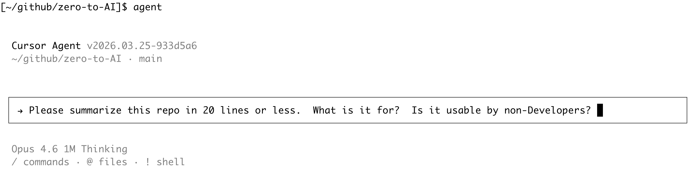
</p>

Ask the agent a question. 

<p align="center">
   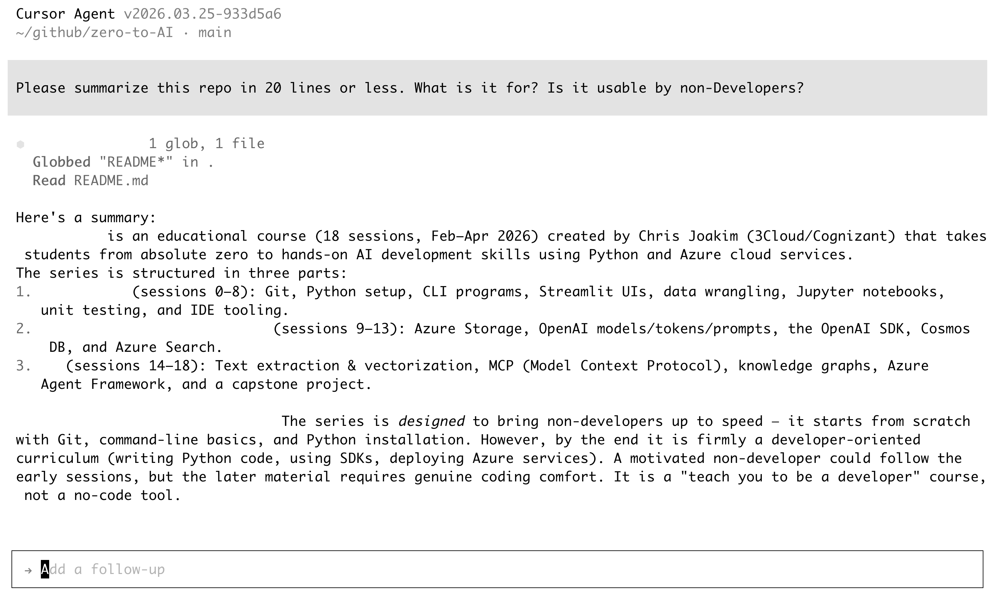
</p>

Ouch, that unbiased perspective hurts! &nbsp; I wanted to appeal more to non-Developers.

Let's try again, ask it to summarize the series.

<p align="center">
   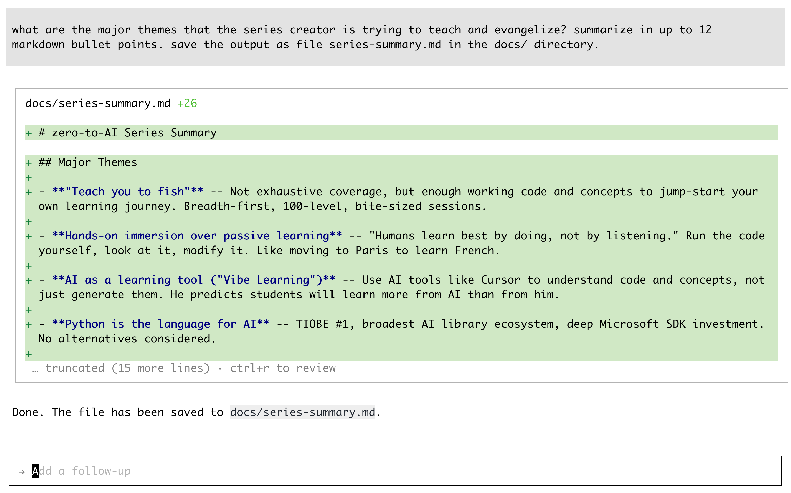
</p>

See the [generated series summary output](series-summary.md).

**Note to self, lesson learned**: For my next similar project, do the following:
- Articulate the goals of the series in a few bullet points in a markdown file
- As I develop the content, ask the agent to tell me if I'm on track in meeting the goals 
- The unbiased (and sometimes brutally honest) feedback is invaluable

<br><br>
---
<br><br>

## Skills

> Agent is Cursor's assistant that can complete complex coding tasks 
> independently, run terminal commands, and edit code. 
> Access in sidepane with Cmd+I.

> Agent Skills is an open standard for extending AI agents with specialized 
> capabilities. Skills package domain-specific knowledge and workflows that 
>agents can use to perform specific tasks.

> Agent Skills are folders of instructions, scripts, and resources that 
>agents can discover and use to do things more accurately and efficiently.


### Example Skill - Rolling Dice 

See file **.agents/skills/roll-dice/SKILL.md** in this repo.

Thus, the skills can be versioned in source-control (i.e. - GitHub).

<p align="center">
   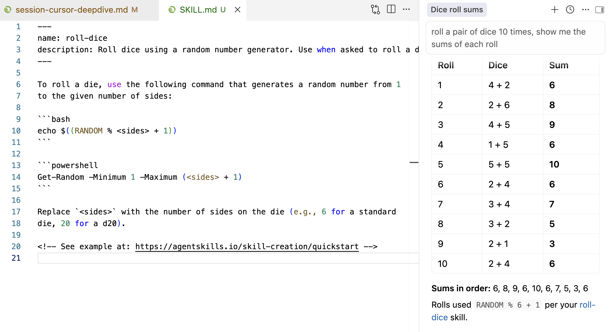
</p>

### Agent Skills Open Standard

The format of these skills is an **Open Standard** called [Agent Skills IO](https://agentskills.io/home).

Microsoft has created [Azure Agent Skills](https://learn.microsoft.com/en-us/training/support/agent-skills) - 
a set 193 of skills that are specific to Azure.

[Claude Code](https://claude.com/product/claude-code) is another AI tool like Cursor.
It also conforms to and supports the Agent Skills Open Standard, thus your skills
are portable across different AI tools and editors.

### Ask Claude Code where it looks for skills

Claude Code is out-of-scope for this series, but here's a brief example of it.

<p align="center">
   
</p>

Copied from the Cursor **.agents** directory to the Claude **.claude** directory.

```
├── .agents
│   └── skills
│       └── roll-dice
│           └── SKILL.md
├── .claude
│   ├── commands
│   │   └── application-review.md
│   ├── settings.json
│   └── skills
│       └── roll-dice
│           └── SKILL.md
```

And now the **roll-dice** skill works in Claude Code, too.

<p align="center">
   
</p>

<br><br>
---
<br><br>

## Links

- [Cursor Docs](https://cursor.com/docs)
- [Cursor Docs MCP](https://cursor.com/docs/mcp )
- [Cursor Docs Installing MCP Servers](https://cursor.com/docs/mcp#installing-mcp-servers)
- [Cursor Marketplace](https://cursor.com/marketplace)
- [Cursor Cookbook](https://cursor.com/docs/cookbook)
- [Cursor API](https://cursor.com/docs/api)
- [Cursor CLI](https://cursor.com/docs/cli)
- [Cursor Skills](https://cursor.com/docs/skills)
- [Cursor Agent Best Practices](https://cursor.com/blog/agent-best-practices)
- [Agent Skills IO](https://agentskills.io/home)
- [Azure Agent Skills](https://learn.microsoft.com/en-us/training/support/agent-skills)
- [Azure MCP Server](https://learn.microsoft.com/en-us/azure/developer/azure-mcp-server/get-started/tools/cursor)
- [Hugging Face MCP Server](https://huggingface.co/docs/hub/agents-mcp)

<br><br>
---
<br><br>

[Home](../README.md)
