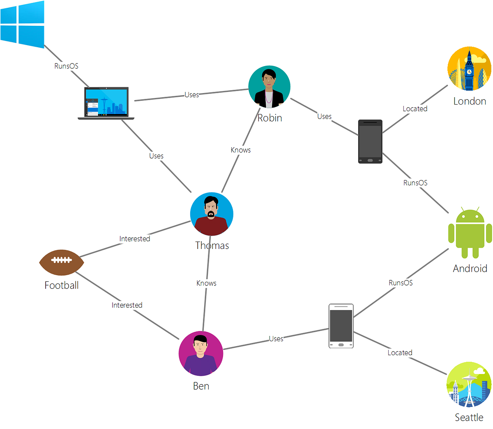
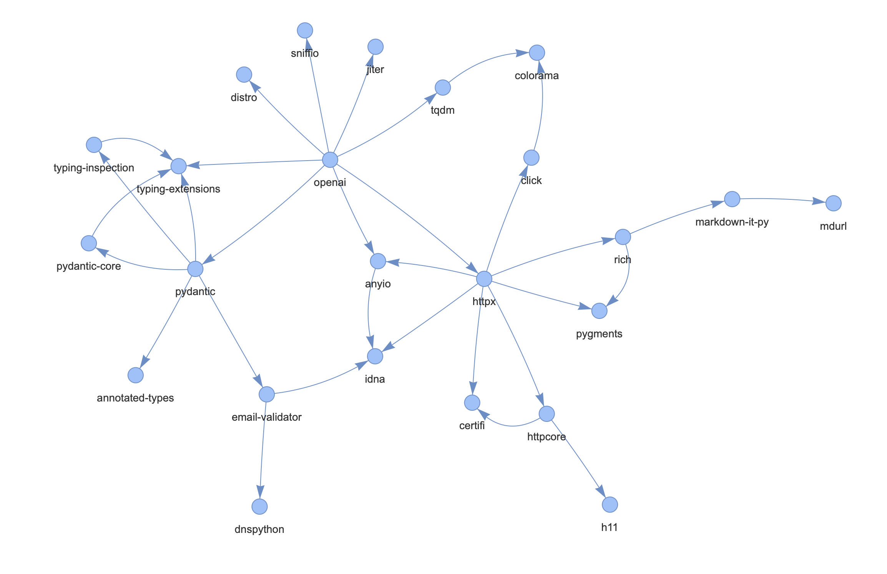

# Part 3, Session 15 - Knowledge Graphs

<br><br>

## Retrieval Augmented Generation (RAG)

- [What is RAG?](https://learn.microsoft.com/en-us/azure/ai-foundry/concepts/retrieval-augmented-generation?view=foundry-classic)
- The LLMs are trained on a generic corpus of data, but NOT the data for YOUR system
- You can **augment** the knowledge of a trained LLM by passing it additional data with each call
- But LLM [context windows](https://learn.microsoft.com/en-us/azure/developer/ai/gen-ai-concepts-considerations-developers) have limited capacity
- Furthermore, passing in large amounts of data makes the LLM call more expensive, in tokens, and slower
- Therefore, strive to pass into the LLM the most useful and concise context data
- This is what RAG tries to achieve
- One solution is to use a [Knowledge Graph](https://en.wikipedia.org/wiki/Knowledge_graph)
- Using a **Graph Database** to get RAG data is called **Graph RAG**

<br><br><br>
---
<br><br><br>

## What does a Graph Look Like?

<p align="center">
   
</p>

<br><br><br>
---
<br><br><br>

## Graph Databases, and the Two Main Types

- Graph databases are **NOT** highly standardized like relational databases with the [ANSI SQL Standard](https://blog.ansi.org/ansi/sql-standard-iso-iec-9075-2023-ansi-x3-135/)
- Graph databases focus on the **relationships between data**, not just the data itself
- Navigating the database through relationships is called **traversing**
- Thw two main types of graph databases are:
  - **Labeled Property Graph (LPG)**
    - The graph consists of **Vertices** (entities) and **Edges** (relationships between the vertices)
    - Examples are Neo4J, Cosmos DB Gremlin API, and the Apache AGE extension in PostgreSQL

  - **Resource Description Framework (RDF)**
    - The graph consists of an array of facts, called [Triples](https://en.wikipedia.org/wiki/Semantic_triple)
    - Each **Triple** consists of a (Subject, Predicate, Object)
    - For example: (Chris, works_at, 3Cloud)
    - The graph has a schema, called an [Ontology](https://en.wikipedia.org/wiki/Ontology_(information_science))
    - The ontology is typically expressed as an [OWL](https://en.wikipedia.org/wiki/Web_Ontology_Language) file, an XML syntax
    - The query language is called **SPARQL**
    - LLMs are well trained on RDF and SPARQL - W3C Standards
    - Therefore, LLMs can generate SPARQL given your ontology
    - Examples are Apache Jena, Stardog, Ontotext, Amazon Neptune

**With graph databases, the relationships are the "first class citizens"**

<br><br>

### Graph Query Syntaxes

Unlike relational databases, graph databases do not have a single common query language (i.e. - SQL).

- **Cypher** - Used in Neo4J, Apache AGE in Azure Postgresql
- **SPARQL** - Used in Apache Jena, Ontotext, Amazon Neptune
- **Gremlin** - Used in Apache Gremlin, Cosmos DB Gremlin API

<br><br><br>
---
<br><br><br>

## Graph Database Maintenance

- LPG graph databases require more "care and feeding" as the data changes
  - All inbound and outbound Edges must be deleted if the Entity is deleted
  - Performance issue related to "orphan edges"
- RDF triples are generally easier to maintain

<br><br><br>
---
<br><br><br>

## Example Graph Implementation and Demonstration

### RDFLib

- This is used in the zero-to-AI series for its relative simplicity
- See [rdflib @ PyPI](https://pypi.org/project/rdflib/)
- rdflib is for small single-node graphs, not large-scale production graphs
- Think of rdflib as similar to sqlite3 - small scale on your laptop

### The Graph Use-Case

- **The Python libraries used in this project; their dependency graph** 
- Determine the most used libraries, and the most "central" libraries
- Visualize the graph, or subsets of it

### The Input Data 

This is nicely provided by the **uv** package manager, and this command:

```
uv export --format cyclonedx1.5 > data/uv/uv-cyclonedx.json
```

See file [uv-cyclonedx.json](../python/data/uv/uv-cyclonedx.json) 

This data is easily parsed.  The library versions aren't used, just the library names.

### The Ontology

The ontology is the schema of the graph.

It is typically expressed as an [OWL](https://en.wikipedia.org/wiki/Web_Ontology_Language) file, an XML syntax.

See file [graph.owl](../python/rdf/graph.owl) 

### Parsing the Input Data and Creating the Graph

```
$ python main-rdf-graph.py build_rdf_graph

Generated rdf/graph.owl successfully
components length 294
dependencies length 295
WARNING:root:file written: tmp/libname_lookup_dict.json
WARNING:root:file written: tmp/libs_and_dependencies_dict.json
graph length: 904
Serialized to rdf/graph.xml
Serialized to rdf/graph.turtle
Serialized to rdf/graph.nt
Serialized to rdf/graph.json-ld
```

RDF has multiple equivalent formats - turtle, ntriples, json-ld, etc.

The output rdf/ files can be loaded into rdflib for ad-hoc querying.

### Querying the Graph

This process loads the graph from the rdf/graph.xml file, and executes
the specified SPARQL query.

#### Count the number of triples in the graph

```
python main-rdf-graph.py query count_all_triples

Loaded rdf/graph.xml (size 904)
Executing SPARQL query:
SELECT (COUNT(*) AS ?count) WHERE { ?s ?p ?o . }

(rdflib.term.Literal('904', datatype=rdflib.term.URIRef('http://www.w3.org/2001/XMLSchema#integer')),)
```

#### The dependencies for the jupyter library

```
python main-rdf-graph.py query deps_for_library jupyter

(rdflib.term.URIRef('http://example.org/libgraph/ipykernel'), rdflib.term.Literal('1', datatype=rdflib.term.URIRef('http://www.w3.org/2001/XMLSchema#integer')))
(rdflib.term.URIRef('http://example.org/libgraph/ipywidgets'), rdflib.term.Literal('1', datatype=rdflib.term.URIRef('http://www.w3.org/2001/XMLSchema#integer')))
(rdflib.term.URIRef('http://example.org/libgraph/jupyter-console'), rdflib.term.Literal('1', datatype=rdflib.term.URIRef('http://www.w3.org/2001/XMLSchema#integer')))
(rdflib.term.URIRef('http://example.org/libgraph/jupyterlab'), rdflib.term.Literal('1', datatype=rdflib.term.URIRef('http://www.w3.org/2001/XMLSchema#integer')))
(rdflib.term.URIRef('http://example.org/libgraph/nbconvert'), rdflib.term.Literal('1', datatype=rdflib.term.URIRef('http://www.w3.org/2001/XMLSchema#integer')))
(rdflib.term.URIRef('http://example.org/libgraph/notebook'), rdflib.term.Literal('1', datatype=rdflib.term.URIRef('http://www.w3.org/2001/XMLSchema#integer')))
(rdflib.term.URIRef('http://example.org/libgraph/anyio'), rdflib.term.Literal('2', datatype=rdflib.term.URIRef('http://www.w3.org/2001/XMLSchema#integer')))
(rdflib.term.URIRef('http://example.org/libgraph/appnope'), rdflib.term.Literal('2', datatype=rdflib.term.URIRef('http://www.w3.org/2001/XMLSchema#integer')))
(rdflib.term.URIRef('http://example.org/libgraph/argon2-cffi'), rdflib.term.Literal('2', datatype=rdflib.term.URIRef('http://www.w3.org/2001/XMLSchema#integer')))
(rdflib.term.URIRef('http://example.org/libgraph/async-lru'), rdflib.term.Literal('2', datatype=rdflib.term.URIRef('http://www.w3.org/2001/XMLSchema#integer')))
(rdflib.term.URIRef('http://example.org/libgraph/babel'), rdflib.term.Literal('2', datatype=rdflib.term.URIRef('http://www.w3.org/2001/XMLSchema#integer')))
(rdflib.term.URIRef('http://example.org/libgraph/certifi'), rdflib.term.Literal('2', datatype=rdflib.term.URIRef('http://www.w3.org/2001/XMLSchema#integer')))
(rdflib.term.URIRef('http://example.org/libgraph/cffi'), rdflib.term.Literal('2', datatype=rdflib.term.URIRef('http://www.w3.org/2001/XMLSchema#integer')))
(rdflib.term.URIRef('http://example.org/libgraph/click'), rdflib.term.Literal('2', datatype=rdflib.term.URIRef('http://www.w3.org/2001/XMLSchema#integer')))
(rdflib.term.URIRef('http://example.org/libgraph/colorama'), rdflib.term.Literal('2', datatype=rdflib.term.URIRef('http://www.w3.org/2001/XMLSchema#integer')))
(rdflib.term.URIRef('http://example.org/libgraph/comm'), rdflib.term.Literal('2', datatype=rdflib.term.URIRef('http://www.w3.org/2001/XMLSchema#integer')))
(rdflib.term.URIRef('http://example.org/libgraph/debugpy'), rdflib.term.Literal('2', datatype=rdflib.term.URIRef('http://www.w3.org/2001/XMLSchema#integer')))
(rdflib.term.URIRef('http://example.org/libgraph/decorator'), rdflib.term.Literal('2', datatype=rdflib.term.URIRef('http://www.w3.org/2001/XMLSchema#integer')))
(rdflib.term.URIRef('http://example.org/libgraph/fastjsonschema'), rdflib.term.Literal('2', datatype=rdflib.term.URIRef('http://www.w3.org/2001/XMLSchema#integer')))
(rdflib.term.URIRef('http://example.org/libgraph/httpcore'), rdflib.term.Literal('2', datatype=rdflib.term.URIRef('http://www.w3.org/2001/XMLSchema#integer')))
(rdflib.term.URIRef('http://example.org/libgraph/httpx'), rdflib.term.Literal('2', datatype=rdflib.term.URIRef('http://www.w3.org/2001/XMLSchema#integer')))
(rdflib.term.URIRef('http://example.org/libgraph/idna'), rdflib.term.Literal('2', datatype=rdflib.term.URIRef('http://www.w3.org/2001/XMLSchema#integer')))
(rdflib.term.URIRef('http://example.org/libgraph/ipython'), rdflib.term.Literal('2', datatype=rdflib.term.URIRef('http://www.w3.org/2001/XMLSchema#integer')))
(rdflib.term.URIRef('http://example.org/libgraph/ipython-pygments-lexers'), rdflib.term.Literal('2', datatype=rdflib.term.URIRef('http://www.w3.org/2001/XMLSchema#integer')))
(rdflib.term.URIRef('http://example.org/libgraph/jedi'), rdflib.term.Literal('2', datatype=rdflib.term.URIRef('http://www.w3.org/2001/XMLSchema#integer')))
(rdflib.term.URIRef('http://example.org/libgraph/jinja2'), rdflib.term.Literal('2', datatype=rdflib.term.URIRef('http://www.w3.org/2001/XMLSchema#integer')))
(rdflib.term.URIRef('http://example.org/libgraph/json5'), rdflib.term.Literal('2', datatype=rdflib.term.URIRef('http://www.w3.org/2001/XMLSchema#integer')))
(rdflib.term.URIRef('http://example.org/libgraph/jsonschema'), rdflib.term.Literal('2', datatype=rdflib.term.URIRef('http://www.w3.org/2001/XMLSchema#integer')))
(rdflib.term.URIRef('http://example.org/libgraph/jupyter-client'), rdflib.term.Literal('2', datatype=rdflib.term.URIRef('http://www.w3.org/2001/XMLSchema#integer')))
(rdflib.term.URIRef('http://example.org/libgraph/jupyter-core'), rdflib.term.Literal('2', datatype=rdflib.term.URIRef('http://www.w3.org/2001/XMLSchema#integer')))
(rdflib.term.URIRef('http://example.org/libgraph/jupyter-events'), rdflib.term.Literal('2', datatype=rdflib.term.URIRef('http://www.w3.org/2001/XMLSchema#integer')))
(rdflib.term.URIRef('http://example.org/libgraph/jupyter-lsp'), rdflib.term.Literal('2', datatype=rdflib.term.URIRef('http://www.w3.org/2001/XMLSchema#integer')))
(rdflib.term.URIRef('http://example.org/libgraph/jupyter-server'), rdflib.term.Literal('2', datatype=rdflib.term.URIRef('http://www.w3.org/2001/XMLSchema#integer')))
(rdflib.term.URIRef('http://example.org/libgraph/jupyter-server-terminals'), rdflib.term.Literal('2', datatype=rdflib.term.URIRef('http://www.w3.org/2001/XMLSchema#integer')))
(rdflib.term.URIRef('http://example.org/libgraph/jupyterlab-server'), rdflib.term.Literal('2', datatype=rdflib.term.URIRef('http://www.w3.org/2001/XMLSchema#integer')))
(rdflib.term.URIRef('http://example.org/libgraph/markupsafe'), rdflib.term.Literal('2', datatype=rdflib.term.URIRef('http://www.w3.org/2001/XMLSchema#integer')))
(rdflib.term.URIRef('http://example.org/libgraph/matplotlib-inline'), rdflib.term.Literal('2', datatype=rdflib.term.URIRef('http://www.w3.org/2001/XMLSchema#integer')))
(rdflib.term.URIRef('http://example.org/libgraph/nbformat'), rdflib.term.Literal('2', datatype=rdflib.term.URIRef('http://www.w3.org/2001/XMLSchema#integer')))
(rdflib.term.URIRef('http://example.org/libgraph/nest-asyncio'), rdflib.term.Literal('2', datatype=rdflib.term.URIRef('http://www.w3.org/2001/XMLSchema#integer')))
(rdflib.term.URIRef('http://example.org/libgraph/notebook-shim'), rdflib.term.Literal('2', datatype=rdflib.term.URIRef('http://www.w3.org/2001/XMLSchema#integer')))
(rdflib.term.URIRef('http://example.org/libgraph/packaging'), rdflib.term.Literal('2', datatype=rdflib.term.URIRef('http://www.w3.org/2001/XMLSchema#integer')))
(rdflib.term.URIRef('http://example.org/libgraph/pexpect'), rdflib.term.Literal('2', datatype=rdflib.term.URIRef('http://www.w3.org/2001/XMLSchema#integer')))
(rdflib.term.URIRef('http://example.org/libgraph/platformdirs'), rdflib.term.Literal('2', datatype=rdflib.term.URIRef('http://www.w3.org/2001/XMLSchema#integer')))
(rdflib.term.URIRef('http://example.org/libgraph/prometheus-client'), rdflib.term.Literal('2', datatype=rdflib.term.URIRef('http://www.w3.org/2001/XMLSchema#integer')))
(rdflib.term.URIRef('http://example.org/libgraph/prompt-toolkit'), rdflib.term.Literal('2', datatype=rdflib.term.URIRef('http://www.w3.org/2001/XMLSchema#integer')))
(rdflib.term.URIRef('http://example.org/libgraph/psutil'), rdflib.term.Literal('2', datatype=rdflib.term.URIRef('http://www.w3.org/2001/XMLSchema#integer')))
(rdflib.term.URIRef('http://example.org/libgraph/pygments'), rdflib.term.Literal('2', datatype=rdflib.term.URIRef('http://www.w3.org/2001/XMLSchema#integer')))
(rdflib.term.URIRef('http://example.org/libgraph/python-dateutil'), rdflib.term.Literal('2', datatype=rdflib.term.URIRef('http://www.w3.org/2001/XMLSchema#integer')))
(rdflib.term.URIRef('http://example.org/libgraph/pywinpty'), rdflib.term.Literal('2', datatype=rdflib.term.URIRef('http://www.w3.org/2001/XMLSchema#integer')))
(rdflib.term.URIRef('http://example.org/libgraph/pyzmq'), rdflib.term.Literal('2', datatype=rdflib.term.URIRef('http://www.w3.org/2001/XMLSchema#integer')))
(rdflib.term.URIRef('http://example.org/libgraph/requests'), rdflib.term.Literal('2', datatype=rdflib.term.URIRef('http://www.w3.org/2001/XMLSchema#integer')))
(rdflib.term.URIRef('http://example.org/libgraph/rich'), rdflib.term.Literal('2', datatype=rdflib.term.URIRef('http://www.w3.org/2001/XMLSchema#integer')))
(rdflib.term.URIRef('http://example.org/libgraph/send2trash'), rdflib.term.Literal('2', datatype=rdflib.term.URIRef('http://www.w3.org/2001/XMLSchema#integer')))
(rdflib.term.URIRef('http://example.org/libgraph/setuptools'), rdflib.term.Literal('2', datatype=rdflib.term.URIRef('http://www.w3.org/2001/XMLSchema#integer')))
(rdflib.term.URIRef('http://example.org/libgraph/soupsieve'), rdflib.term.Literal('2', datatype=rdflib.term.URIRef('http://www.w3.org/2001/XMLSchema#integer')))
(rdflib.term.URIRef('http://example.org/libgraph/stack-data'), rdflib.term.Literal('2', datatype=rdflib.term.URIRef('http://www.w3.org/2001/XMLSchema#integer')))
(rdflib.term.URIRef('http://example.org/libgraph/terminado'), rdflib.term.Literal('2', datatype=rdflib.term.URIRef('http://www.w3.org/2001/XMLSchema#integer')))
(rdflib.term.URIRef('http://example.org/libgraph/tinycss2'), rdflib.term.Literal('2', datatype=rdflib.term.URIRef('http://www.w3.org/2001/XMLSchema#integer')))
(rdflib.term.URIRef('http://example.org/libgraph/tornado'), rdflib.term.Literal('2', datatype=rdflib.term.URIRef('http://www.w3.org/2001/XMLSchema#integer')))
(rdflib.term.URIRef('http://example.org/libgraph/traitlets'), rdflib.term.Literal('2', datatype=rdflib.term.URIRef('http://www.w3.org/2001/XMLSchema#integer')))
(rdflib.term.URIRef('http://example.org/libgraph/typing-extensions'), rdflib.term.Literal('2', datatype=rdflib.term.URIRef('http://www.w3.org/2001/XMLSchema#integer')))
(rdflib.term.URIRef('http://example.org/libgraph/wcwidth'), rdflib.term.Literal('2', datatype=rdflib.term.URIRef('http://www.w3.org/2001/XMLSchema#integer')))
(rdflib.term.URIRef('http://example.org/libgraph/webencodings'), rdflib.term.Literal('2', datatype=rdflib.term.URIRef('http://www.w3.org/2001/XMLSchema#integer')))
(rdflib.term.URIRef('http://example.org/libgraph/websocket-client'), rdflib.term.Literal('2', datatype=rdflib.term.URIRef('http://www.w3.org/2001/XMLSchema#integer')))
(rdflib.term.URIRef('http://example.org/libgraph/argon2-cffi-bindings'), rdflib.term.Literal('3', datatype=rdflib.term.URIRef('http://www.w3.org/2001/XMLSchema#integer')))
(rdflib.term.URIRef('http://example.org/libgraph/asttokens'), rdflib.term.Literal('3', datatype=rdflib.term.URIRef('http://www.w3.org/2001/XMLSchema#integer')))
(rdflib.term.URIRef('http://example.org/libgraph/attrs'), rdflib.term.Literal('3', datatype=rdflib.term.URIRef('http://www.w3.org/2001/XMLSchema#integer')))
(rdflib.term.URIRef('http://example.org/libgraph/beautifulsoup4'), rdflib.term.Literal('3', datatype=rdflib.term.URIRef('http://www.w3.org/2001/XMLSchema#integer')))
(rdflib.term.URIRef('http://example.org/libgraph/bleach'), rdflib.term.Literal('3', datatype=rdflib.term.URIRef('http://www.w3.org/2001/XMLSchema#integer')))
(rdflib.term.URIRef('http://example.org/libgraph/charset-normalizer'), rdflib.term.Literal('3', datatype=rdflib.term.URIRef('http://www.w3.org/2001/XMLSchema#integer')))
(rdflib.term.URIRef('http://example.org/libgraph/defusedxml'), rdflib.term.Literal('3', datatype=rdflib.term.URIRef('http://www.w3.org/2001/XMLSchema#integer')))
(rdflib.term.URIRef('http://example.org/libgraph/executing'), rdflib.term.Literal('3', datatype=rdflib.term.URIRef('http://www.w3.org/2001/XMLSchema#integer')))
(rdflib.term.URIRef('http://example.org/libgraph/fqdn'), rdflib.term.Literal('3', datatype=rdflib.term.URIRef('http://www.w3.org/2001/XMLSchema#integer')))
(rdflib.term.URIRef('http://example.org/libgraph/h11'), rdflib.term.Literal('3', datatype=rdflib.term.URIRef('http://www.w3.org/2001/XMLSchema#integer')))
(rdflib.term.URIRef('http://example.org/libgraph/isoduration'), rdflib.term.Literal('3', datatype=rdflib.term.URIRef('http://www.w3.org/2001/XMLSchema#integer')))
(rdflib.term.URIRef('http://example.org/libgraph/jsonpointer'), rdflib.term.Literal('3', datatype=rdflib.term.URIRef('http://www.w3.org/2001/XMLSchema#integer')))
(rdflib.term.URIRef('http://example.org/libgraph/jsonschema-specifications'), rdflib.term.Literal('3', datatype=rdflib.term.URIRef('http://www.w3.org/2001/XMLSchema#integer')))
(rdflib.term.URIRef('http://example.org/libgraph/jupyterlab-pygments'), rdflib.term.Literal('3', datatype=rdflib.term.URIRef('http://www.w3.org/2001/XMLSchema#integer')))
(rdflib.term.URIRef('http://example.org/libgraph/markdown-it-py'), rdflib.term.Literal('3', datatype=rdflib.term.URIRef('http://www.w3.org/2001/XMLSchema#integer')))
(rdflib.term.URIRef('http://example.org/libgraph/mistune'), rdflib.term.Literal('3', datatype=rdflib.term.URIRef('http://www.w3.org/2001/XMLSchema#integer')))
(rdflib.term.URIRef('http://example.org/libgraph/nbclient'), rdflib.term.Literal('3', datatype=rdflib.term.URIRef('http://www.w3.org/2001/XMLSchema#integer')))
(rdflib.term.URIRef('http://example.org/libgraph/pandocfilters'), rdflib.term.Literal('3', datatype=rdflib.term.URIRef('http://www.w3.org/2001/XMLSchema#integer')))
(rdflib.term.URIRef('http://example.org/libgraph/parso'), rdflib.term.Literal('3', datatype=rdflib.term.URIRef('http://www.w3.org/2001/XMLSchema#integer')))
(rdflib.term.URIRef('http://example.org/libgraph/ptyprocess'), rdflib.term.Literal('3', datatype=rdflib.term.URIRef('http://www.w3.org/2001/XMLSchema#integer')))
(rdflib.term.URIRef('http://example.org/libgraph/pure-eval'), rdflib.term.Literal('3', datatype=rdflib.term.URIRef('http://www.w3.org/2001/XMLSchema#integer')))
(rdflib.term.URIRef('http://example.org/libgraph/pycparser'), rdflib.term.Literal('3', datatype=rdflib.term.URIRef('http://www.w3.org/2001/XMLSchema#integer')))
(rdflib.term.URIRef('http://example.org/libgraph/python-json-logger'), rdflib.term.Literal('3', datatype=rdflib.term.URIRef('http://www.w3.org/2001/XMLSchema#integer')))
(rdflib.term.URIRef('http://example.org/libgraph/pyyaml'), rdflib.term.Literal('3', datatype=rdflib.term.URIRef('http://www.w3.org/2001/XMLSchema#integer')))
(rdflib.term.URIRef('http://example.org/libgraph/referencing'), rdflib.term.Literal('3', datatype=rdflib.term.URIRef('http://www.w3.org/2001/XMLSchema#integer')))
(rdflib.term.URIRef('http://example.org/libgraph/rfc3339-validator'), rdflib.term.Literal('3', datatype=rdflib.term.URIRef('http://www.w3.org/2001/XMLSchema#integer')))
(rdflib.term.URIRef('http://example.org/libgraph/rfc3986-validator'), rdflib.term.Literal('3', datatype=rdflib.term.URIRef('http://www.w3.org/2001/XMLSchema#integer')))
(rdflib.term.URIRef('http://example.org/libgraph/rfc3987-syntax'), rdflib.term.Literal('3', datatype=rdflib.term.URIRef('http://www.w3.org/2001/XMLSchema#integer')))
(rdflib.term.URIRef('http://example.org/libgraph/rpds-py'), rdflib.term.Literal('3', datatype=rdflib.term.URIRef('http://www.w3.org/2001/XMLSchema#integer')))
(rdflib.term.URIRef('http://example.org/libgraph/six'), rdflib.term.Literal('3', datatype=rdflib.term.URIRef('http://www.w3.org/2001/XMLSchema#integer')))
(rdflib.term.URIRef('http://example.org/libgraph/uri-template'), rdflib.term.Literal('3', datatype=rdflib.term.URIRef('http://www.w3.org/2001/XMLSchema#integer')))
(rdflib.term.URIRef('http://example.org/libgraph/urllib3'), rdflib.term.Literal('3', datatype=rdflib.term.URIRef('http://www.w3.org/2001/XMLSchema#integer')))
(rdflib.term.URIRef('http://example.org/libgraph/webcolors'), rdflib.term.Literal('3', datatype=rdflib.term.URIRef('http://www.w3.org/2001/XMLSchema#integer')))
(rdflib.term.URIRef('http://example.org/libgraph/arrow'), rdflib.term.Literal('4', datatype=rdflib.term.URIRef('http://www.w3.org/2001/XMLSchema#integer')))
(rdflib.term.URIRef('http://example.org/libgraph/lark'), rdflib.term.Literal('4', datatype=rdflib.term.URIRef('http://www.w3.org/2001/XMLSchema#integer')))
(rdflib.term.URIRef('http://example.org/libgraph/mdurl'), rdflib.term.Literal('4', datatype=rdflib.term.URIRef('http://www.w3.org/2001/XMLSchema#integer')))
(rdflib.term.URIRef('http://example.org/libgraph/tzdata'), rdflib.term.Literal('5', datatype=rdflib.term.URIRef('http://www.w3.org/2001/XMLSchema#integer')))
```

#### Centrality Query 

```
python main-rdf-graph.py query centrality_sparql_query

Executing SPARQL query:

    PREFIX libgraph: <http://example.org/libgraph#>
    PREFIX rdf: <http://www.w3.org/1999/02/22-rdf-syntax-ns#>

    SELECT ?lib (COUNT(*) AS ?useCount)
    WHERE {
      ?user libgraph:uses_lib ?lib .
    }
    GROUP BY ?lib
    ORDER BY DESC(?useCount)
    LIMIT 10


(rdflib.term.URIRef('http://example.org/libgraph/typing-extensions'), rdflib.term.Literal('34', datatype=rdflib.term.URIRef('http://www.w3.org/2001/XMLSchema#integer')))
(rdflib.term.URIRef('http://example.org/libgraph/opentelemetry-api'), rdflib.term.Literal('20', datatype=rdflib.term.URIRef('http://www.w3.org/2001/XMLSchema#integer')))
(rdflib.term.URIRef('http://example.org/libgraph/azure-core'), rdflib.term.Literal('15', datatype=rdflib.term.URIRef('http://www.w3.org/2001/XMLSchema#integer')))
(rdflib.term.URIRef('http://example.org/libgraph/traitlets'), rdflib.term.Literal('13', datatype=rdflib.term.URIRef('http://www.w3.org/2001/XMLSchema#integer')))
(rdflib.term.URIRef('http://example.org/libgraph/packaging'), rdflib.term.Literal('12', datatype=rdflib.term.URIRef('http://www.w3.org/2001/XMLSchema#integer')))
(rdflib.term.URIRef('http://example.org/libgraph/opentelemetry-instrumentation'), rdflib.term.Literal('12', datatype=rdflib.term.URIRef('http://www.w3.org/2001/XMLSchema#integer')))
(rdflib.term.URIRef('http://example.org/libgraph/opentelemetry-semantic-conventions'), rdflib.term.Literal('12', datatype=rdflib.term.URIRef('http://www.w3.org/2001/XMLSchema#integer')))
(rdflib.term.URIRef('http://example.org/libgraph/pydantic'), rdflib.term.Literal('9', datatype=rdflib.term.URIRef('http://www.w3.org/2001/XMLSchema#integer')))
(rdflib.term.URIRef('http://example.org/libgraph/opentelemetry-util-http'), rdflib.term.Literal('9', datatype=rdflib.term.URIRef('http://www.w3.org/2001/XMLSchema#integer')))
(rdflib.term.URIRef('http://example.org/libgraph/isodate'), rdflib.term.Literal('9', datatype=rdflib.term.URIRef('http://www.w3.org/2001/XMLSchema#integer')))
```

<br><br><br>
---
<br><br><br>

## Graph Visualizations 

There are many ways to visualize a graph.

- [matplotlib](https://matplotlib.org) python library
- [networkx](https://networkx.org) python library
- [pyvis](https://pyvis.readthedocs.io/en/latest/) python library
- [D3.js](https://d3js.org)  (JavaScript)
- [Gephi](https://gephi.org)  (Java)
- Many others...


This visualization was generated by the **networkx** and **pyvis** libraries
using the data file **data/uv/uv-cyclonedx.json** in **python/main-networkx.py**.

This visualization below shows the dependencies for the **openai** library
and all its transitive dependencies.

<p align="center">
   
</p>


### Generating a Graph Visualization

For one of the python libraries used in the zero-to-AI project, you can
generate a graph visualization with the following command.
Replace openai with the name of the library you want to visualize.

```
python main-networkx.py openai
```

<br><br><br>
---
<br><br><br>

## Other Microsoft Graph Reference Applications

- [CosmosAIGraph and OmniRAG - Cosmos DB and Apache Jena](https://github.com/AzureCosmosDB/CosmosAIGraph)
- [AIGraph4PG - Apache AGE in Azure Postgresql](https://github.com/cjoakim/AIGraph4pg)

<br><br><br>
---
<br><br><br>

## Homework

- Look at OWL file **python/rdf/graph.owl** in this repo and understand how to define an ontology for a RDF graph
- Execute the graph queries shown above, and try to understand the SPARQL syntax 
- Use Cursor or othr AI tool to generate SPARQL from your natural language query/prompt and OWL file
- See alternative implementations - the above two Microsoft Graph Reference Applications

<br><br><br>
---
<br><br><br>

[Home](../README.md)
