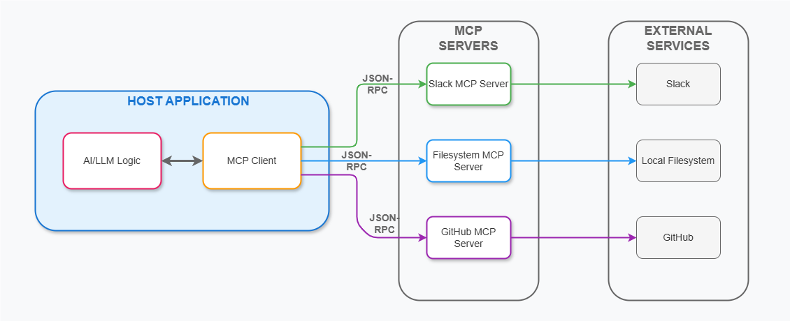
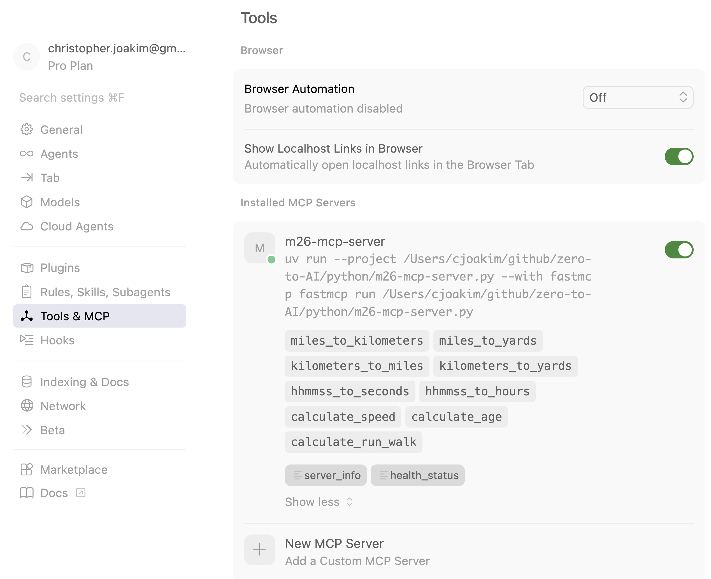
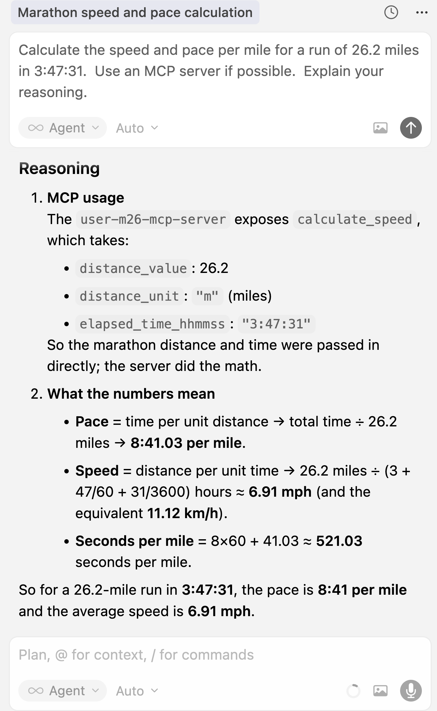

# Part 3, Session 16 - MCP, the Model Context Protocol

<br><br>

## The Model Context Protocol (MCP)

- [What is MCP?](https://modelcontextprotocol.io/docs/getting-started/intro)
- Think of MCP **like a USB design, but for AI applications**
- **Simple standard design and protocol** to plug into for [Agentic AI applications](https://en.wikipedia.org/wiki/AI_agent)
- The Agents operate autonomously using this standard protocol
- But, you describe to the LLM what your MCP servers can do, and how

<br>

### REST (Representational State Transfer) Web Services Design 

- REST is a **simple standard design and protocol** for web services
- https://en.wikipedia.org/wiki/REST
- 1990s - ad-hoc and inconsistent designs
- Year 2000, by Roy Fielding in his doctoral dissertation
- This design has been very helpful to simplify and standardize web applications 
- **Likewise, MCP is expected to simplify and standardize agentic AI applications**

<br><br><br>
---
<br><br><br>

### MCP Servers 

These implement **Tools** and/or **Resources** an/or **Prompts** 
that can be invoked/called by the MCP Client.

A **Resource** is a read-only data source.

A **Tool** is an executable function.  It can access external systems, databases, and services
to perform actions.  It can be simple function or complex.  It can invoke an LLM, or not.

The Tool documents what is for, how to call it, and what the response will be.

For example, a Weather MCP server might have a **Tool** to get the current weather 
for a given location.  It might also have a **Resource** to get the weather history
for a given location.

<br><br><br>
---
<br><br><br>

### MCP Clients 

An MCP client is an application that can invoke/call a MCP server.

There is a **one-to-one** relationship between an MCP client and an MCP server
within a host application.

The job of the client is to call the server and get a response.

MCP Clients run within an LLM-powered **host application** or **Agentic AI Application**.

<br><br><br>
---
<br><br><br>

## What are Agentic AI Applications?

### Agency (for humans)

> [Agency](https://en.wikipedia.org/wiki/Agency_(psychology)) is the sense of control
> that you feel in your life, your capacity to influence your own thoughts and behavior,
> and have faith in your ability to handle a wide range of tasks and situations

### Agency (for agentic AI applications)

- You define the set of MCP Server(s) that the application can use 
  - The collective set of tools and resources (see above)
- Given a task to complete (i.e. - a prompt), the agentic application will operate **autonomously**
- It will determine what MCP Servers, tools, and resources to use, and in what sequence
- This is a NOT Developer-specified set of imperative logic 
- **Instead, the Agentic AI application figures out, itself, how to complete the task!**

<br><br><br>
---
<br><br><br>

## Agentic AI Architecture

<p align="center">
   
</p>

<br><br><br>
---
<br><br><br>

## FastAPI

- [FastAPI Home](https://fastapi.tiangolo.com)
- It's a fast, modern, and asynchronous framework for python web services
- Uses the [Pydantic](https://docs.pydantic.dev/latest/) library to describe requests and responses
  - The **"shape"** of the data - attributes and their types
- It provides automatic generation of [Swagger/OpenAPI](https://swagger.io) documentation
- Recommendation: Use FastAPI rather than Flask framework for your python web apps and services

### FastAPI and Pydantic Example 

The Item pydantic model defines the "shape" of the data,
and this model is used in the update_Item function.

The incoming data must conform to the "shape" of the Item model.

The output data may also be defined with a pydantic model.

```
from fastapi import FastAPI
from pydantic import BaseModel

app = FastAPI()

class Item(BaseModel):
    name: str
    description: str | None
    price: float
    tax: float | None

@app.put("/items/{item_id}")
async def update_item(item_id: int, item: Item):
   ... update the item in the database ...
```

<br><br><br>
---
<br><br><br>

## FastMCP

- [FastMCP](https://gofastmcp.com/getting-started/welcome)
- **Built on FastAPI, but intended for MCP Servers instead of general HTTP servers**
- It's very easy to use and greatly simplifies agentic AI application development
- You use annotations/decorators to define the tools, resources, and prompts 
  - **@mcp.tool**, **@mcp.resource**, **@mcp.prompt**
  - See the code below for an example

<br><br><br>
---
<br><br><br>

## Cursor

It has functionality to use/call MCP servers.  See https://cursor.com/docs/mcp 

<br><br><br>
---
<br><br><br>

## Example App and Demonstration: m26 MCP Server in Cursor

### What's m26?

- It's a simple python library I created; see https://pypi.org/project/m26/ 
- For running, cycling, and swimming calculations

### Example Application 

- Cursor itself will play the part of the **host application** or **Agentic AI Application**
- We'll creare a MCP Server that implements tools that use the m26 library to perform calculations 
- We'll use the Chat View in Cursor to submit prompts
- Cursor, the agentic AI application, will determine how to solve the problem 

### The MCP Server Code 

It's as simple as annotating the functions with **@mcp.tool()** or **@mcp.resource()**
and defining the input and output data as **Pydantic Models**.

Then, just implement each method with regular python code.

See the full code in file **python/m26-mcp-server.py**.
The following is an abbreviated version of the code.

```python
from fastmcp import FastMCP

import m26

from src.app.mcp_constants import MCPConstants

# These are the Pydantic Models for the MCP Server's Tools and Resources
from src.app.mcp_models import (
    HealthStatusModel,
    RunWalkCalculationModel,
    ServerCapabilitiesModel,
    ServerEndpointsModel,
    ServerInfoModel,
    SpeedCalculationModel,
)

@mcp.tool()
def miles_to_kilometers(miles: float) -> Optional[float]:
    """
    Convert miles to kilometers.
    For example: miles_to_kilometers(10.0) -> 16.0934
    Returns None if the conversion fails.
    """
    return convert_distance(miles, MCPConstants.UOM_MILES, MCPConstants.UOM_KILOMETERS)

@mcp.tool()
def miles_to_yards(miles: float) -> Optional[float]:
   ... implementation not shown ...


@mcp.tool()
def calculate_speed(
    distance_value: float, distance_unit: str, elapsed_time_hhmmss: str
) -> Optional[SpeedCalculationModel]:
   ... implementation not shown ...


... other tools not shown ...

@mcp.resource("health://status")
def health_status() -> HealthStatusModel:
   ... implementation not shown ...

```

### The MCP Client Code 

See the full code in file **python/m26-mcp-client.py**.
The following is an abbreviated version of the code.

Here we're invoking the MCP Server tool (see above) named **miles_to_kilometers**.

```
from fastmcp import Client

SERVER_URL = "http://127.0.0.1:8157/mcp"
client = Client(SERVER_URL)

async def invoke_tools():
    result = await client.call_tool("miles_to_kilometers", {"miles": 10.0})
    print(f"   Result: {result}")
    print(f"   Data:   {result.data}")

   ... invoke the other tools ...
```

### Executing the MCP Client and Server on your Laptop in HTTP Mode 

In one PowerShell or Terminal window, in the python directory,run the MCP Server:

```
.\m26-mcp-server.ps1   # Windows PowerShell
- or - 
./m26-mcp-server.sh    # macOS or Linux
```

You should see output similar to the following:

<p align="center">
   
</p>

<br><br>

In another PowerShell or Terminal window, in the python directory, run the MCP Client.
This client will do the following:
- list the server capabilities
- access the resources
- invoke each of the tools

You should see output similar to the following.  Notice how the tools are discovered
by the client, and each is commented as in the server code.

```
(python) [~/github/zero-to-AI/python]$ python m26-mcp-client.py
Starting client: m26-mcp-client.py
================================================================================
FastMCP 2 Client for m26-mcp/server.py
================================================================================
Connecting to server at: http://127.0.0.1:8157/mcp

================================================================================
SERVER CAPABILITIES
================================================================================

Pinging the server:
   Ping: True

Listing available tools:
   Found 9 tools:
      - miles_to_kilometers: Convert miles to kilometers.
For example: miles_to_kilometers(10.0) -> 16.0934
Returns None if the conversion fails.
      - miles_to_yards: Convert miles to yards.
For example: miles_to_yards(10.0) -> 17600.0
Returns None if the conversion fails.
      - kilometers_to_miles: Convert kilometers to miles.
For example: kilometers_to_miles(10.0) -> 6.21371
Returns None if the conversion fails.
      - kilometers_to_yards: Convert kilometers to yards.
For example: kilometers_to_yards(10.0) -> 10936.133
Returns None if the conversion fails.
      - hhmmss_to_seconds: Convert a 'hh:mm:ss' formatted string to seconds.
For example: hhmmss_to_seconds("01:01:01") -> 3661.0
Returns None if the conversion fails.
      - hhmmss_to_hours: Convert a 'hh:mm:ss' formatted string to hours.
For example: hhmmss_to_hours("01:01:01") -> 1.01694
Returns None if the conversion fails.
      - calculate_speed: Calculate the speed in miles per hour, kilometers per hour, yards per hour, seconds per mile, and pace per mile.
The distance_value must be a positive number.
The distance_unit must be one of the following: "m" (miles), "k" (kilometers), or "y" (yards).
The elapsed_time_hhmmss must be a valid 'hh:mm:ss' formatted string.
Returns None if the calculation fails.
      - calculate_age: Calculate the age between two dates in years.
For example: calculate_age("1960-10-01", "2025-10-01") -> 65.0
The two dates must be in the format "yyyy-mm-dd".
Returns None if the calculation fails.
      - calculate_run_walk: Calculate average pace and projected time for a run/walk strategy.
The run_hhmmss is the duration of the run interval in 'mm:ss' format (e.g., "2:30").
The run_ppm is the running pace per mile in 'mm:ss' format (e.g., "9:16").
The walk_hhmmss is the duration of the walk interval in 'mm:ss' format (e.g., "0:45").
The walk_ppm is the walking pace per mile in 'mm:ss' format (e.g., "17:00").
The miles is the total distance in miles (e.g., 31.0).
Returns None if the calculation fails.

Listing available resources:
   Found 2 resources:
      - server://info: server_info
      - health://status: health_status

Listing available prompts:
   Found 0 prompts:

================================================================================
ACCESSING RESOURCES
================================================================================

1. Reading resource 'health://status':
   Error: Error reading resource 'health://status': contents must be str, bytes, or list[ResourceContent], got HealthStatusModel

2. Reading resource 'server://info':
   Error: Error reading resource 'server://info': contents must be str, bytes, or list[ResourceContent], got ServerInfoModel

================================================================================
INVOKING TOOLS
================================================================================

1. miles_to_kilometers(10.0):
   Result: CallToolResult(content=[TextContent(type='text', text='16.09344', annotations=None, meta=None)], structured_content={'result': 16.09344}, meta=None, data=16.09344, is_error=False)
   Data:   16.09344

2. miles_to_yards(10.0):
   Result: CallToolResult(content=[TextContent(type='text', text='17600.0', annotations=None, meta=None)], structured_content={'result': 17600.0}, meta=None, data=17600.0, is_error=False)
   Data:   17600.0

3. kilometers_to_miles(10.0):
   Result: CallToolResult(content=[TextContent(type='text', text='6.2137119223733395', annotations=None, meta=None)], structured_content={'result': 6.2137119223733395}, meta=None, data=6.2137119223733395, is_error=False)
   Data:   6.2137119223733395

4. kilometers_to_yards(10.0):
   Result: CallToolResult(content=[TextContent(type='text', text='10936.132983377076', annotations=None, meta=None)], structured_content={'result': 10936.132983377076}, meta=None, data=10936.132983377076, is_error=False)
   Data:   10936.132983377076

5. hhmmss_to_seconds('01:01:01'):
   Result: CallToolResult(content=[TextContent(type='text', text='3661.0', annotations=None, meta=None)], structured_content={'result': 3661.0}, meta=None, data=3661.0, is_error=False)
   Data:   3661.0

6. hhmmss_to_hours('01:01:01'):
   Result: CallToolResult(content=[TextContent(type='text', text='1.0169444444444444', annotations=None, meta=None)], structured_content={'result': 1.0169444444444444}, meta=None, data=1.0169444444444444, is_error=False)
   Data:   1.0169444444444444

7. calculate_speed(distance_value=26.2, distance_unit='m', elapsed_time_hhmmss='3:47:30'):
   Result: CallToolResult(content=[TextContent(type='text', text='{"successful":true,"distance_value":26.2,"distance_unit":"m","elapsed_time_hhmmss":"03:47:30","miles_per_hour":6.90989010989011,"kilometers_per_hour":11.120390189010989,"yards_per_hour":12161.406593406595,"seconds_per_mile":520.9923664122138,"pace_per_mile":"8:40.99"}', annotations=None, meta=None)], structured_content={'result': {'successful': True, 'distance_value': 26.2, 'distance_unit': 'm', 'elapsed_time_hhmmss': '03:47:30', 'miles_per_hour': 6.90989010989011, 'kilometers_per_hour': 11.120390189010989, 'yards_per_hour': 12161.406593406595, 'seconds_per_mile': 520.9923664122138, 'pace_per_mile': '8:40.99'}}, meta=None, data=Root(successful=True, distance_value=26.2, distance_unit='m', elapsed_time_hhmmss='03:47:30', miles_per_hour=6.90989010989011, kilometers_per_hour=11.120390189010989, yards_per_hour=12161.406593406595, seconds_per_mile=520.9923664122138, pace_per_mile='8:40.99'), is_error=False)
   Data:   Root(successful=True, distance_value=26.2, distance_unit='m', elapsed_time_hhmmss='03:47:30', miles_per_hour=6.90989010989011, kilometers_per_hour=11.120390189010989, yards_per_hour=12161.406593406595, seconds_per_mile=520.9923664122138, pace_per_mile='8:40.99')

8. calculate_age('1960-10-01', '2025-10-01'):
   Result: CallToolResult(content=[TextContent(type='text', text='64.99931553730322', annotations=None, meta=None)], structured_content={'result': 64.99931553730322}, meta=None, data=64.99931553730322, is_error=False)
   Data:   64.99931553730322

9. calculate_run_walk(run_hhmmss='2:30', run_ppm='9:16', walk_hhmmss='0:45', walk_ppm='17:00', miles=31.0):
   Result: CallToolResult(content=[TextContent(type='text', text='{"run_hhmmss":"2:30","run_ppm":"9:16","walk_hhmmss":"0:45","walk_ppm":"17:00","miles":31.0,"avg_mph":5.4292343387471,"avg_ppm":"11:03.07","proj_time":"05:42:35","proj_miles":31.0}', annotations=None, meta=None)], structured_content={'result': {'run_hhmmss': '2:30', 'run_ppm': '9:16', 'walk_hhmmss': '0:45', 'walk_ppm': '17:00', 'miles': 31.0, 'avg_mph': 5.4292343387471, 'avg_ppm': '11:03.07', 'proj_time': '05:42:35', 'proj_miles': 31.0}}, meta=None, data=Root(run_hhmmss='2:30', run_ppm='9:16', walk_hhmmss='0:45', walk_ppm='17:00', miles=31.0, avg_mph=5.4292343387471, avg_ppm='11:03.07', proj_time='05:42:35', proj_miles=31.0), is_error=False)
   Data:   Root(run_hhmmss='2:30', run_ppm='9:16', walk_hhmmss='0:45', walk_ppm='17:00', miles=31.0, avg_mph=5.4292343387471, avg_ppm='11:03.07', proj_time='05:42:35', proj_miles=31.0)

================================================================================
CLIENT EXECUTION COMPLETE
================================================================================
```

<br><br><br>
---
<br><br><br>

## Demonstration: a m26 MCP Server in Cursor

### Deploy the MCP Server to Cursor 

Execute the following PowerShell or Bash script to deploy the MCP Server to Cursor.

```
.\m26-mcp-deploy2cursor.ps1   # Windows PowerShell
- or - 
./m26-mcp-deploy2cursor.sh    # macOS or Linux
```

You should see output similar to the following in Cursor.

<p align="center">
   
</p>

### Submit a Prompt in Cursor 

```
Calculate the speed and pace per mile for a run of 26.2 miles in 3:47:31.
Use an MCP server if possible.
Explain your reasoning.
```

<p align="center">
   
</p>

<br><br><br>
---
<br><br><br>

## Homework

- Visit https://modelcontextprotocol.io/docs/getting-started/intro and read the documentation
- Run the demo on your computer 
- If you have Cursor, deploy the MCP Server to Cursor and submit a prompt to it

<br><br><br>
---
<br><br><br>

[Home](../README.md)

